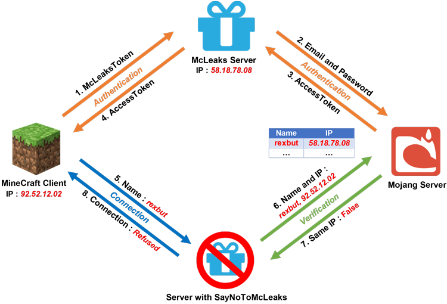
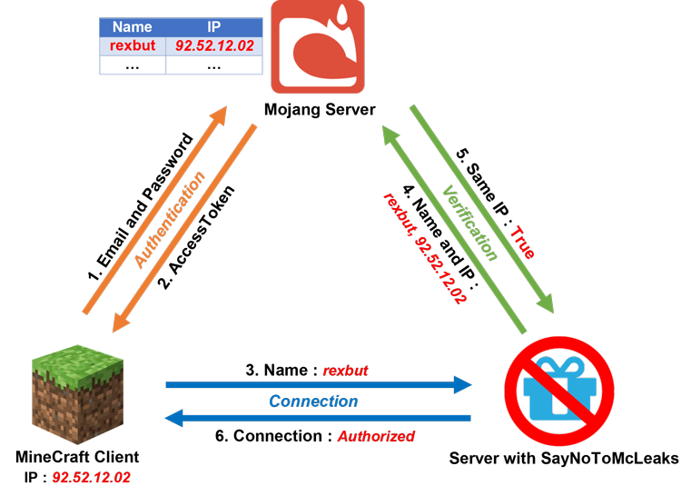

SayNoToMcLeaks
=============

## Description ##
This plugin block Alt Account System same as McLeaks or AltDispenser.

SayNoToMcLeaks uses MojangAPI to check IP Authentication on Minecraft.net and on your server.
If the result doesnt the same, the plugin execute custom commands (Editable on config file).

Please share SayNoToMcLeaks to your friends or others because
more SayNoToMcLeaks will be installed on Minecraft servers.
More McLeaks and Alt account system will be useless.
A minecraft plugin for Bukkit platforms.

[More informations](wiki.vg)

## Stolen Account ##

## Legal Account ##

## Links ##
* [Download](https://www.spigotmc.org/resources/saynotomcleaks.40906/download?version=161748)
* [Issues](https://github.com/EverCraft/SayNoToMcLeaks/issues)
* [Website](http://evercraft.fr)
* [Support Me](https://www.paypal.com/cgi-bin/webscr?cmd=_s-xclick&hosted_button_id=RUSKPBMNJG5R4)

## License ##
This plugin is licensed under [GNU License](https://github.com/EverCraft/SayNoToMcLeaks/blob/master/LICENSE).

## Prerequisites ##
* [Java](http://www.oracle.com/technetwork/java/javase/downloads/jdk7-downloads-1880260.html) 7

## Clone ##
The following steps will ensure your project is cloned properly

1. `git clone --recurse git@github.com:EverCraft/SayNoToMcLeaks.git`
2. `cd SayNoToMcLeaks`

## Building ##

### On Windows ###

1. Shift + right click the folder with SayNoToMcLeaks's files and click "Open command prompt".
2. `gradlew clean`
3. `gradlew build`
4. The plugins are located in the folder '/folder/of/SayNoToMcLeaks/build/libs/'

### On Linux or Mac OS X ###

1. In your terminal, navigate to the folder with SayNoToMcLeaks's files (`cd /folder/of/SayNoToMcLeaks/`)
2. `./gradlew clean`
3. `./gradlew build`
4. The plugins are located in the folder '/folder/of/SayNoToMcLeaks/build/libs/'
